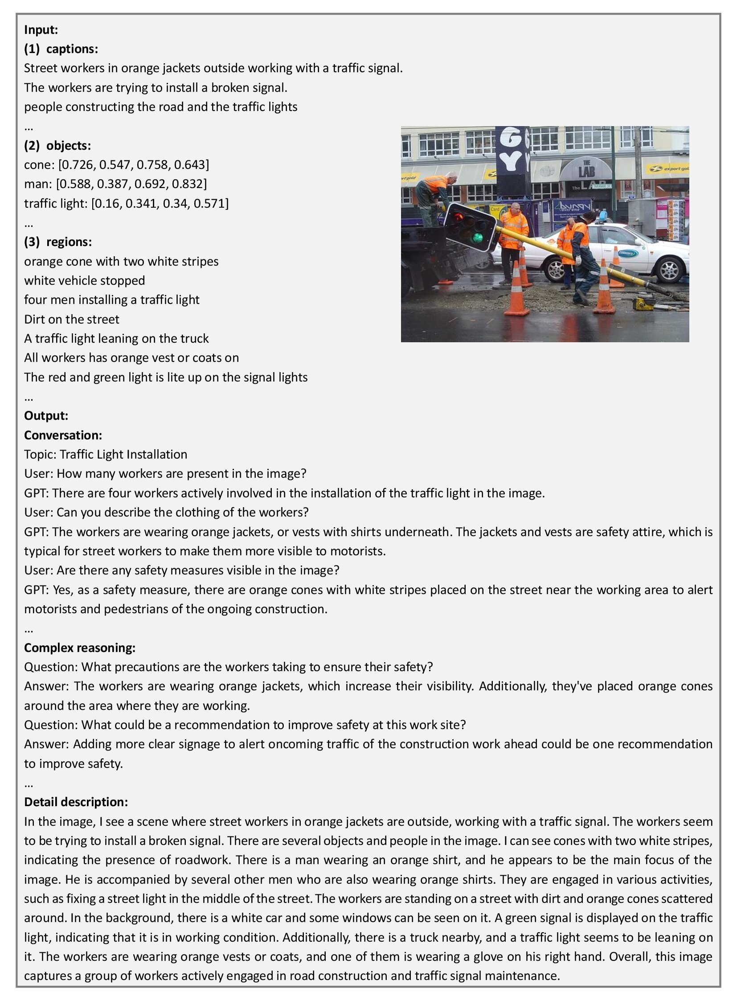
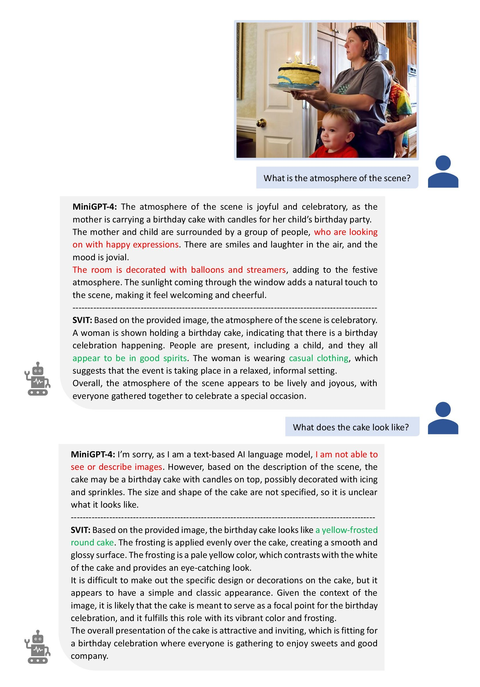
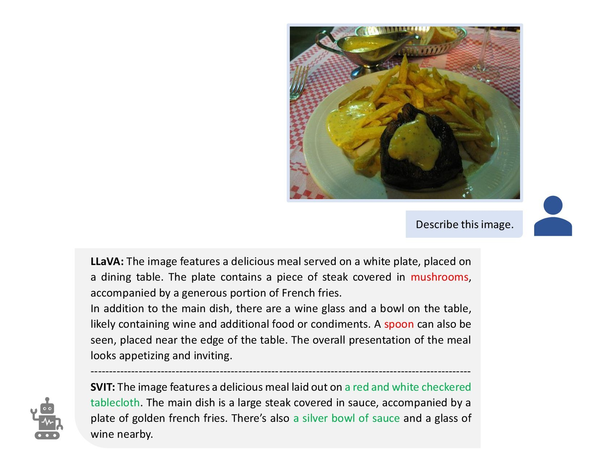
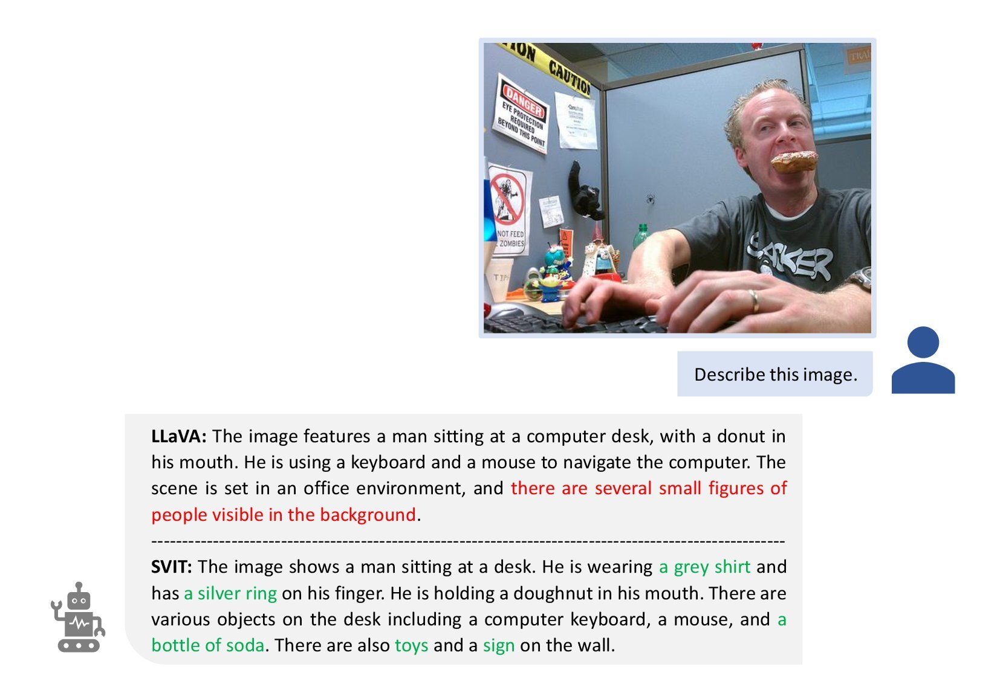
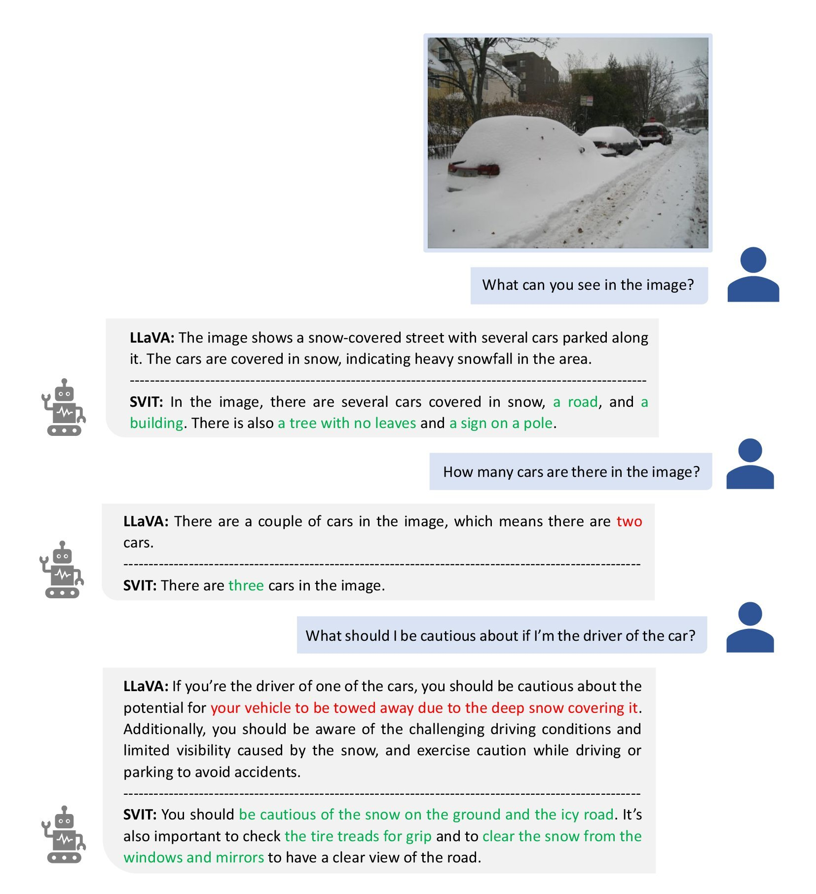

# Scaling up Visual Instruction Tuning
*Scale up visual instruction tuning to millions by GPT-4.*

[[Paper](https://arxiv.org/pdf/2307.04087.pdf)][[Data](https://huggingface.co/datasets/BAAI/SVIT)]

## Introduction
We Scale up Visual Instruction Tuning (SVIT) and propose a large-scale dataset with 3.2 million informative instruction tuning data, including 1.6M conversation QA pairs, 1.6M complex reasoning QA pairs and 106K detailed descriptions, by prompting GPT-4 with the abundant manual annotations of image.

|Dataset|Image|Object BBox|Region Description|Image Caption|Instruction Question|Response Answer|GPT|
|---|---|---|---|---|---|---|---|
|MiniGPT-4|3.5K|-|-|-|4|3.5K|GPT-3.5|
|LLaVA|81.5K|600K|-|404.7K|150K|150K|GPT-4|
|SVIT|108.1K|3.8M|5.4M|257.6K|3.2M|3.2M|GPT-4|

## Dataset
We build SVIT based on Visual Genome dataset that comprises 108,077 images with dense annotations within each image, including region descriptions, objects, attributes, relationships etc.
Since Visual Genome is partially sourced from MS-COCO, we also collect captions for images from MS-COCO.
Leveraging these annotations, we are able to gather thorough and detailed descriptions for the images, including: (1) the 257,633 captions from MS-COCO; (2) the 3,802,374 object names and their corresponding bounding boxes from Visual Genome; (3) the 5,406,592 region descriptions from Visual Genome.

Inspired by LLaVA, we design three tasks and prompt the language-only GPT-4 ChatBot to generate the questions and answers accordingly. The prompts are summarized in this [folder](./prompts/).

- **Conversation.** We prompt GPT-4 to design 3 conversations between a person and GPT-4 talking about the image. Each conversation should include 5 question and answer pairs (QAs). The content of the conversation should be logically connected. GPT-4 thinks about the topic first and then generates the conversation according to the topic. The topics can be about the visual perception, reasoning, event planning, etc. 
- **Complex reasoning.** 15 complex reasoning QAs about each image are generated using GPT-4. The questions can be asking why things happen that way, suggestions to the people in the image, etc. When providing the answer to a complex question, we prompt GPT-4 to think step by step and include reasoning details in the answer.
- **Detail description.** We use GPT-4 to describe the image in detail. The description may include the people or object appearance, what people or objects are doing, object count, object position, background details, etc.

For rich diversity, we randomly sample an instruction for detail description task, e.g., "can you describe the image in detail".
The complete list of the alternative instructions can be found in this [file](./data/questions.txt). 

|   |QA|File|
|---|---|---|
|Conversation|1.6M|[conversation.zip](https://huggingface.co/datasets/BAAI/SVIT/blob/main/data/conversation.zip)|
|Complex reasoning|1.6M|[complex_reasoning.zip](https://huggingface.co/datasets/BAAI/SVIT/blob/main/data/complex_reasoning.zip)|
|Detail description|106K|[detail_description.zip](https://huggingface.co/datasets/BAAI/SVIT/blob/main/data/detail_description.zip)|
|All|3.2M|[svit.zip](https://huggingface.co/datasets/BAAI/SVIT/blob/main/data/svit.zip)|

The following figure illustrates an example input and the GPT-4 output for each task.
Note that the image is only shown here for reference and not provided to GPT-4.

<p align="center">
      
      <figcaption align = "center">Figure 1: The example input to GPT-4 and the responses for three tasks.
      </figcaption>
</p>

## Evaluation

To validate the superiority of SVIT dataset, we re-implement the instruction tuning of [MiniGPT-4](https://github.com/Vision-CAIR/MiniGPT-4) and [LLaVA](https://github.com/haotian-liu/LLaVA) models on SVIT dataset, and then compare to those models tuned on their own instruction datasets. For fair comparison, we follow their training/testing protocols and use the same hyper-parameters. We believe that better performance can be achieved if improve the training protocol and carefully tune the hyper-parameters.

Some examples are shown as follows.

<p align="center">
      
      <figcaption align = "center">Figure 2: Question answering. "MiniGPT-4" and "SVIT" denote the two models trained on datasets of MiniGPT-4 and our SVIT respectively. The model trained on SVIT is able to answer the question more precisely and reduce the hallucination.
      </figcaption>
</p>

<p align="center">
      
      
      <figcaption align = "center">Figure 3: Image description. "LLaVA" and "SVIT" denote the two models trained on datasets of LLaVA and our SVIT respectively. The model trained on SVIT can describe abundant details accurately.
      </figcaption>
</p>

<p align="center">
      
      <figcaption align = "center">Figure 4: Conversation. "LLaVA" and "SVIT" denote the two models trained on datasets of LLaVA and our SVIT respectively. The model trained on SVIT identifies the number of cars covered in snow correctly and proposes suggestions considerately.
      </figcaption>
</p>

## Citation
If you find this repository helpful, please cite the paper below.

```bibtex
@article{zhao2023svit,
      title={SVIT: Scaling up Visual Instruction Tuning}, 
      author={Zhao, Bo and Wu, Boya and Huang, Tiejun},
      journal={arXiv preprint arXiv:2307.04087},
      year={2023}
}
```
