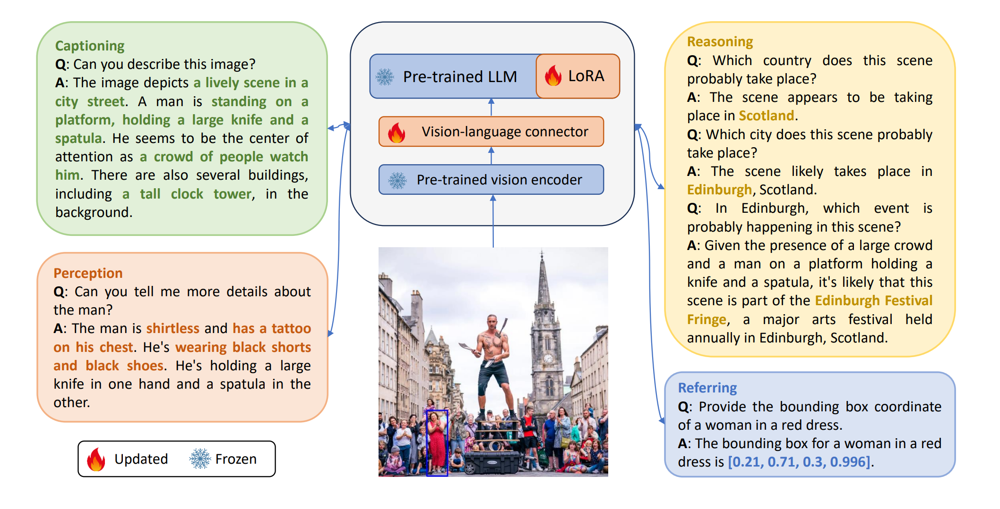
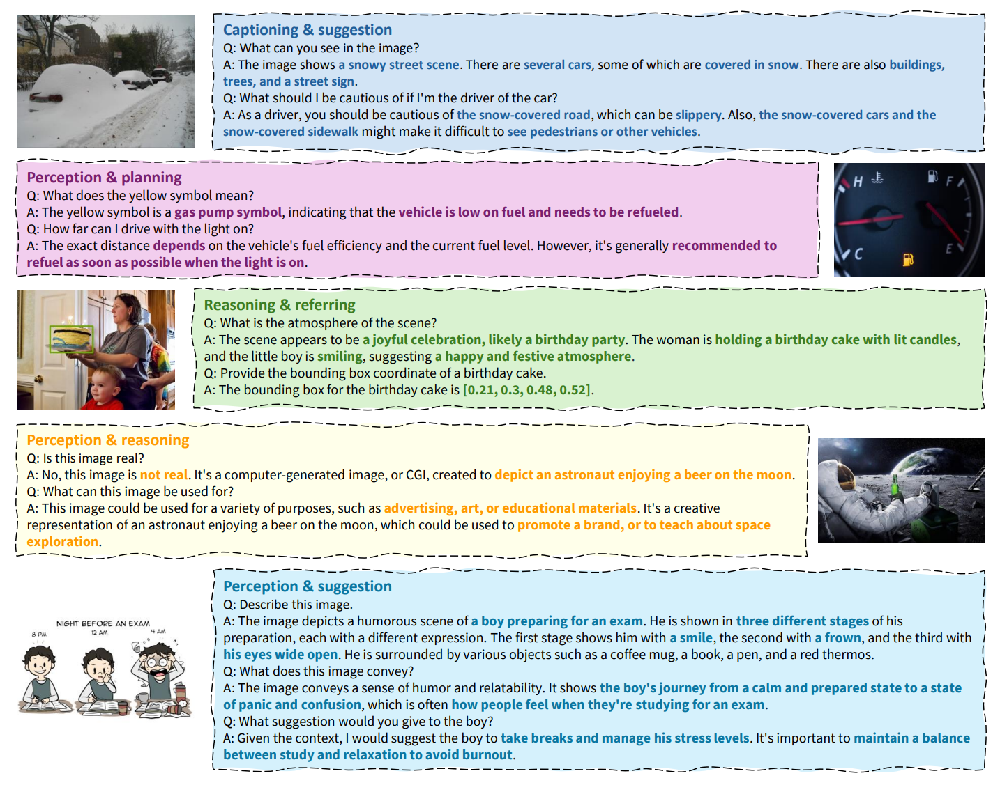

# Scaling up Visual Instruction Tuning

*Scale up visual instruction tuning to millions by GPT-4.*

[[Paper](https://arxiv.org/pdf/2307.04087.pdf)][[Data](https://huggingface.co/datasets/BAAI/SVIT)]

## Introduction

We Scale up Visual Instruction Tuning (SVIT) by constructing a dataset of 4.2 million visual instruction tuning data
including 1.6M conversation question-answer (QA) pairs, 1.6M complex reasoning QA pairs, 1.0M referring QA pairs and
106K detailed image description, by prompting GPT-4 with the abundant manual annotations of image.

| Dataset   | Image  | Object BBox | Region Description | Image Caption | Instruction Question | Response Answer | GPT     |
|-----------|--------|-------------|--------------------|---------------|----------------------|-----------------|---------|
| MiniGPT-4 | 3.5K   | -           | -                  | -             | 4                    | 3.5K            | GPT-3.5 |
| LLaVAR*   | 16K    | -           | -                  | -             | 16K                  | 16K             | GPT-4   | 
| LLaVA     | 81.5K  | 600K        | -                  | 404.7K        | 150K                 | 150K            | GPT-4   |
| SVIT      | 108.1K | 3.8M        | 5.4M               | 257.6K        | 4.2M                 | 4.2M            | GPT-4   |

*LLaVAR collects 422K noisy instruction-following data using OCR results and 16K high-quality data using GPT-4.

## Model Zoo

| Checkpoint                                                                     | Data                                                                                   | Schedule   | MME perception | MME cognition | MMBench | MMBench-Chinese | SEED-Bench-1 | MMMU | VQA-v2 | GQA  | VisWiz | ScienceQA-IMG | TextVQA |
|--------------------------------------------------------------------------------|----------------------------------------------------------------------------------------|------------|----------------|---------------|---------|-----------------|--------------|------|--------|------|--------|---------------|---------|
| [SVIT-v1.5-LoRA](https://huggingface.co/Isaachhe/svit-v1.5-13b-lora/tree/main) | [SVIT-mix-665K](https://huggingface.co/datasets/BAAI/SVIT/tree/main/format/llava-v1.5) | lora-1e    | 1560.3         | 364.3         | 68.3    | 63.2            | 61.8         | 34.1 | 80.1   | 63.4 | 56.7   | 69.9          | 61.1    | 
| [SVIT-v1.5-Full](https://huggingface.co/Isaachhe/svit-v1.5-13b-full/tree/main) | [SVIT-mix-665K](https://huggingface.co/datasets/BAAI/SVIT/tree/main/format/llava-v1.5) | full_ft-1e | 1565.8         | 323.2         | 69.1    | 63.1            | 61.9         | 33.3 | 80.3   | 64.1 | 56.4   | 70.0          | 60.8    | 
* Note that SVIT-mix-665K is in the format of LLaVA-v1.5 for training the model, so it has some differences with the original SVIT format. More explanations are [here](https://huggingface.co/datasets/BAAI/SVIT#introduction). 

### Training and Evaluation

The above models are trained on LLaVA-v1.5's architecture. Please follow [LLaVA](https://github.com/haotian-liu/LLaVA/tree/main) to set up the code and evaluate the models.

Specifically for training, please refer to the [visual instruction tuning stage of LLaVA-v1.5](https://github.com/haotian-liu/LLaVA/tree/main?tab=readme-ov-file#visual-instruction-tuning), you should just replace LLaVA-v1.5-mix-665K with our SVIT-mix-665K and keep all others remaining.

## Dataset

We build SVIT based on Visual Genome dataset that comprises 108,077 images with dense annotations within each image,
including region descriptions, objects, attributes, relationships etc.
Since Visual Genome is partially sourced from MS-COCO, we also collect captions for images from MS-COCO.
Leveraging these annotations, we are able to gather thorough and detailed descriptions for the images, including: (1)
the 257,633 captions from MS-COCO; (2) the 3,802,374 object names and their corresponding bounding boxes from Visual
Genome; (3) the 5,406,592 region descriptions from Visual Genome.

Inspired by LLaVA, we design four tasks and prompt the language-only GPT-4 ChatBot to generate the questions and answers
accordingly. The prompts are summarized in this [folder](./prompts/).

- **Conversation.** We prompt GPT-4 to design 3 conversations between a person and GPT-4 talking about the image. Each
  conversation should include 5 question and answer pairs (QAs). The content of the conversation should be logically
  connected. GPT-4 thinks about the topic first and then generates the conversation according to the topic. The topics
  can be about the visual perception, reasoning, event planning, etc.
- **Complex reasoning.** 15 complex reasoning QAs about each image are generated using GPT-4. The questions can be
  asking why things happen that way, suggestions to the people in the image, etc. When providing the answer to a complex
  question, we prompt GPT-4 to think step by step and include reasoning details in the answer.
- **Detail description.** We use GPT-4 to describe the image in detail. The description may include the people or object
  appearance, what people or objects are doing, object count, object position, background details, etc.
- **Referring QAs.** We prompt GPT-4 to create 10 question and answer pairs of specific regions in the image. When
  referring to any object in the question or answer, always wrap it with prefix "\<st\>", suffix "\<ed\>" and attach its
  bounding box after it, in the format of "\<st\>object\<ed\> [x1, y1, x2, y2]". If multiple objects are referred to,
  attach all the corresponding bounding boxes after them, e.g., "
  \<st\>objects\<ed\> [x1, y1, x2, y2], [x1, y1, x2, y2]".

For rich diversity, we randomly sample an instruction for detail description task, e.g., "can you describe the image in
detail".
The complete list of the alternative instructions can be found in this [file](./data/questions.txt).

## Method

We employ the open-source Multimodal Large Language Model - LLaVA, which consists of a vision encoder, a large language
model and a vision-language connector. We illustrate the model in Figure 1.

<p align="center">
      
      <figcaption align = "center">Figure 1: SVIT-v1.5 (LoRA) model architecture and abilities.</figcaption>
</p>

## Qualitative Evaluation

<p align="center">
      
      <figcaption align = "center">Figure 2: Demonstration of different abilities of SVIT-v1.5.</figcaption>
</p>

## Citation

If you find this repository helpful, please cite the paper below.

```bibtex
@article{zhao2023svit,
      title={SVIT: Scaling up Visual Instruction Tuning}, 
      author={Zhao, Bo and Wu, Boya and He, Muyang and Huang, Tiejun},
      journal={arXiv preprint arXiv:2307.04087},
      year={2023}
}
```
